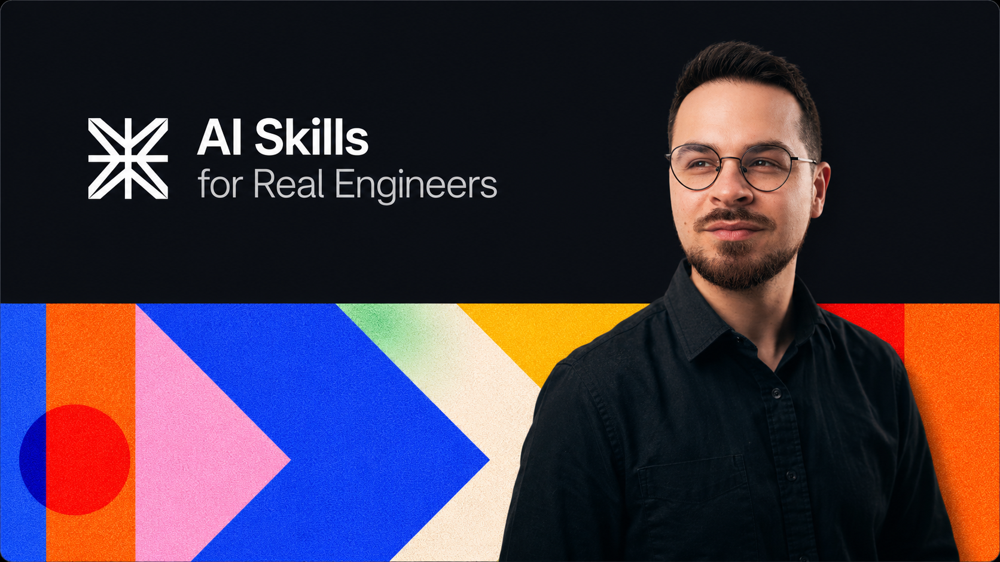

<p>
  
</p>

# Skills

Agent skills and specialized agents for Claude Code.

## Install

```bash
git clone https://github.com/corneliu-iancu/skills.git
cd skills
./install.sh
```

This symlinks all skills and agents into `~/.claude/skills/` and `~/.claude/agents/`, making them available alongside your existing ones. Skills appear as `/skill-name` — no namespacing.

## Skills (11)

| Bucket | Skill | Description |
|--------|-------|-------------|
| **frontend** | [react-best-practices](./skills/frontend/react-best-practices/SKILL.md) | React/Next.js performance patterns from Vercel Engineering |
| **meta** | [context-engineering](./skills/meta/context-engineering/SKILL.md) | Context engineering for multi-agent architectures |
| **meta** | [subagent-driven-development](./skills/meta/subagent-driven-development/SKILL.md) | Parallel subagent orchestration for implementation plans |
| **productivity** | [ask-better-questions](./skills/productivity/ask-better-questions/SKILL.md) | Refine questions through 7 Socratic lenses |
| **productivity** | [caveman](./skills/productivity/caveman/SKILL.md) | Ultra-compressed communication — ~75% fewer tokens |
| **productivity** | [grill-me](./skills/productivity/grill-me/SKILL.md) | Relentless interview about your plan until every branch is resolved |
| **productivity** | [write-a-skill](./skills/productivity/write-a-skill/SKILL.md) | Create new skills with proper structure and progressive disclosure |
| **quality** | [verification-before-completion](./skills/quality/verification-before-completion/SKILL.md) | Verify before claiming done — evidence before assertions |
| **security** | [differential-review](./skills/security/differential-review/SKILL.md) | Security-focused diff review with blast radius calculation |
| **security** | [insecure-defaults](./skills/security/insecure-defaults/SKILL.md) | Detect fail-open insecure defaults in production configs |
| **testing** | [property-based-testing](./skills/testing/property-based-testing/SKILL.md) | Property-based testing across languages and smart contracts |

## Agents (5)

| Bucket | Agent | Description |
|--------|-------|-------------|
| **frontend** | [accessibility-tester](./agents/frontend/accessibility-tester.md) | WCAG compliance and assistive technology assessment |
| **performance** | [performance-engineer](./agents/performance/performance-engineer.md) | Bottleneck identification and profiling |
| **quality** | [architect-reviewer](./agents/quality/architect-reviewer.md) | System design and architectural pattern evaluation |
| **quality** | [code-reviewer](./agents/quality/code-reviewer.md) | Code quality, security, and best practices review |
| **security** | [penetration-tester](./agents/security/penetration-tester.md) | Authorized offensive security testing |

## Structure

```
skills/
├── .claude-plugin/plugin.json   # Plugin manifest
├── skills/<bucket>/<name>/      # Skills (SKILL.md + references)
├── agents/<bucket>/<name>.md    # Agent definitions
├── hooks/                       # Session-notes hook
├── scripts/                     # Dev utilities
└── CLAUDE.md                    # Repo rules
```

## License

MIT
