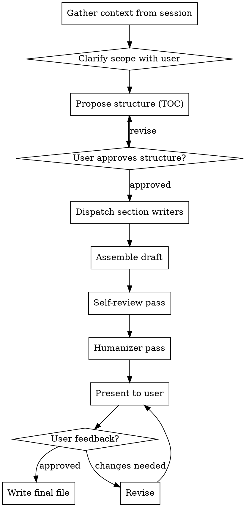

# Write Docs

Turn session knowledge into structured, readable technical documentation. You are the controller — you plan the document, delegate sections to focused subagents, assemble the result, and polish it.

## When This Triggers

You've been working through something — debugging, setting up infrastructure, exploring an API, configuring a tool — and now the user wants a written artifact that captures what was learned. The documentation lives beyond this session: other people (or future-you) will read it cold.

## The Process



## Step 1: Gather and Clarify

Before proposing structure, understand what you're documenting:

**Extract from session context:**
- What was built, configured, or discovered
- Key decisions and their rationale
- Commands that worked (and gotchas that didn't)
- Dependencies, prerequisites, environment details

**Ask the user (one at a time, skip what's obvious from context):**
- Who reads this? (team members, open source users, future self)
- What do they need to do after reading? (set up, understand, decide, troubleshoot)
- Where does this live? (README section, standalone guide, wiki page, repo docs/)
- What format? (tutorial with steps, reference doc, explanation, how-to guide)

These four documentation types come from Divio's documentation system — pick the right one and the structure follows naturally:
- **Tutorial**: learning-oriented, follows a path, "do this then this"
- **How-to guide**: task-oriented, solves a specific problem, assumes competence
- **Explanation**: understanding-oriented, gives context and background
- **Reference**: information-oriented, accurate and complete, like a dictionary

## Step 2: Propose Structure

Present a table of contents with one-line descriptions of what each section covers. Keep it lean — documentation that's too long doesn't get read.

**Format your proposal like:**

```
## Proposed structure

**File:** `docs/setup-guide.md`
**Type:** How-to guide
**Audience:** Team developers setting up locally

1. **Prerequisites** — what you need installed before starting
2. **Installation** — clone, install deps, configure env
3. **Configuration** — the three env vars and what they control
4. **Verification** — how to confirm it's working
5. **Troubleshooting** — the two gotchas we hit during setup

Estimated length: ~200 lines. Sound right?
```

Wait for approval. Adjust if the user wants sections added, removed, or reordered.

## Step 3: Delegate Sections

Dispatch one subagent per section (or group small related sections). Each subagent gets:

1. **The section brief** — what to cover, approximate length, level of detail
2. **Audience context** — who reads this, what they already know
3. **Source material** — specific facts, commands, code snippets, decisions from the session
4. **Style guidance** — see the Style section below

**Subagent prompt template:**

```
Write a documentation section. Return ONLY the markdown content (no fences wrapping it).

**Section:** [title]
**Brief:** [what to cover]
**Audience:** [who, what they know]
**Type:** [tutorial / how-to / explanation / reference]
**Source material:**
[paste the relevant facts, commands, code, decisions]

**Style rules:**
- Write for someone reading this cold — no "as we discussed" or "as mentioned above"
- Use second person ("you") for instructions
- Code blocks with language tags
- One idea per paragraph
- Short paragraphs (3-4 lines max)
- Prefer concrete examples over abstract descriptions
- If a step can fail, say what failure looks like and what to do
```

**Parallelization:** Independent sections can be dispatched in parallel. Sections that reference each other (e.g., "Configuration" needs to know what "Installation" set up) should be sequential — or give the later section the content from the earlier one.

## Step 4: Assemble and Review

Combine section outputs into one document. Then do two passes:

**Self-review (do this yourself, inline):**
- Consistent heading levels and terminology throughout
- No contradictions between sections
- No gaps where "the reader needs to know X but no section covers it"
- Logical reading order — does each section build on the previous?
- Code examples actually match the described steps
- No orphan references ("see below" pointing nowhere)

**Humanizer pass:**
Read the assembled draft through the lens of the humanizer skill. Specifically check for:
- Significance inflation ("crucial", "vital", "key")
- Promotional language ("powerful", "seamless", "robust")
- Copula avoidance ("serves as" instead of "is")
- Filler phrases ("in order to" → "to")
- Sycophantic intros ("Great question!")
- Em dash overuse
- Bolded list headers where flowing prose would work better

Fix issues inline. The goal is documentation that reads like a competent engineer wrote it, not an AI.

## Step 5: Present and Iterate

Show the full draft to the user. Don't ask "should I continue?" — present it and wait.

If the user has feedback:
- For small fixes: apply directly
- For section rewrites: re-dispatch that section's subagent with the feedback as additional guidance
- After changes, do another quick humanizer check on the modified sections

When approved, write the final file to the agreed path.

## Style Defaults

Unless the user specifies otherwise:

- **Headings:** sentence case ("Getting started" not "Getting Started")
- **Code blocks:** always tagged with language (`bash`, `json`, `typescript`, etc.)
- **Commands:** show the command AND its expected output when useful
- **Links:** inline `[text](url)` not reference-style
- **Lists:** use when items are genuinely parallel; don't force prose into bullets
- **Length:** as short as possible while remaining complete — every sentence earns its place
- **Tone:** direct, confident, no hedging ("this will" not "this should probably")
- **Structure:** front-load the useful information — don't make readers wade through context to find the command they need

## Choosing Not to Subagent

For short documents (under ~100 lines, 2-3 sections), skip the subagent dispatch — write it directly. The subagent pattern pays off when:
- The document has 4+ substantial sections
- Different sections need different expertise or source material
- The total length would be 150+ lines
- Writing it all inline would bloat your context

## Output

The final artifact is always a `.md` file written to disk. Confirm the path with the user before writing. Common locations:
- `docs/` in the project root
- `README.md` (appended or replaced section)
- Wiki or standalone file

After writing, show the file path and a one-line summary of what was documented.
